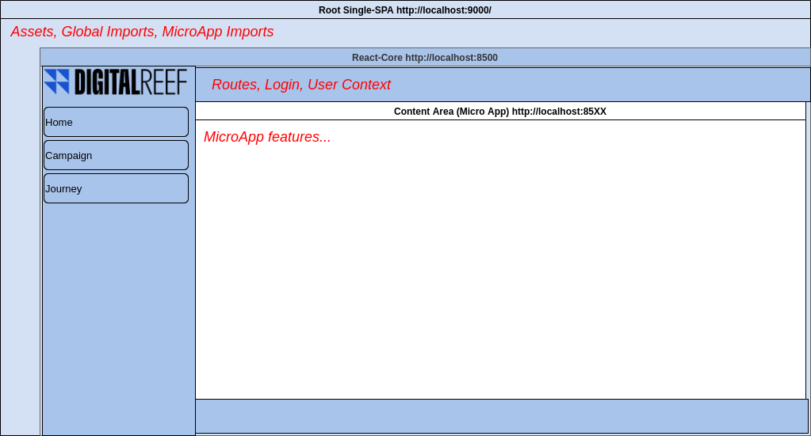

# DR ONE PORTAL

##### Before Start:

1. Make sure if your code has been updated from "main" branch;
2. To new MicroApp use the [react-template](https://github.com/Digita1Reef/dr-one-react-microapp-template "react-template");
3. To new branches use the Jira's task id as the name. (Ex. DRON-17_CorePage)
##### The project structure is:

```bash
├── root
│   ├── src
│   │   ├── assets
│   │   │   ├── img
│   │   │   │   ├── *[images.files]*
│   │   ├── index.ejs
├── core
└── campaign
```


####  React Micro App Template [link](https://github.com/Digita1Reef/dr-one-react-microapp-template "link")

#### Root

In this project we have the main file **index.ejs** where we start our project as an HTML file, adding meta tags, links, and scripts to remote files.

Any images assets must be inserted in this project to build correctly, then be used using _img_ path

```html

```

```
NOTE: When we need to share the same libraries among any projects, it's important to include the library in the index.ejs as a CDN link and into the microapp's **webpack -> externals** to improve the app performance and build.
```

#### Core

In this project, we start SPA application as a base project, where we should make login, control public and private routes, and collect end-user data.

```
NOTE: the essential routes in the project must be inserted in this project.
```

## Quick start

- Navigate to the folders root, core, and [micro-name]:

- Install the dependencies:

`yarn`

- Running:

`yarn start`

## Build All

On source working directory '/' running
`yarn build:all` to testing environment or `yarn build:all:prod` to production environment
## Build Each

- Navigate to the folders root, core, and [micro-name]:

- Install the dependencies:

- Running:

`yarn build` to testing environment or `yarn build:prod` to production environment

```
NOTE 1: Root Project and Core Project must be running to access other micro-apps
NOTE 2: Any new project must have an exclusive port as (Ex. 8500, 8501, etc) and be imported in root project -> index.ejs, then insert this port at 'packege.json -> scripts -> start' project (Ex. "start": "webpack serve --port 850X")
NOTE 3: Folders without Micro-App must starts with "." as ".deploy" to not conflit with micro-app names.
```


